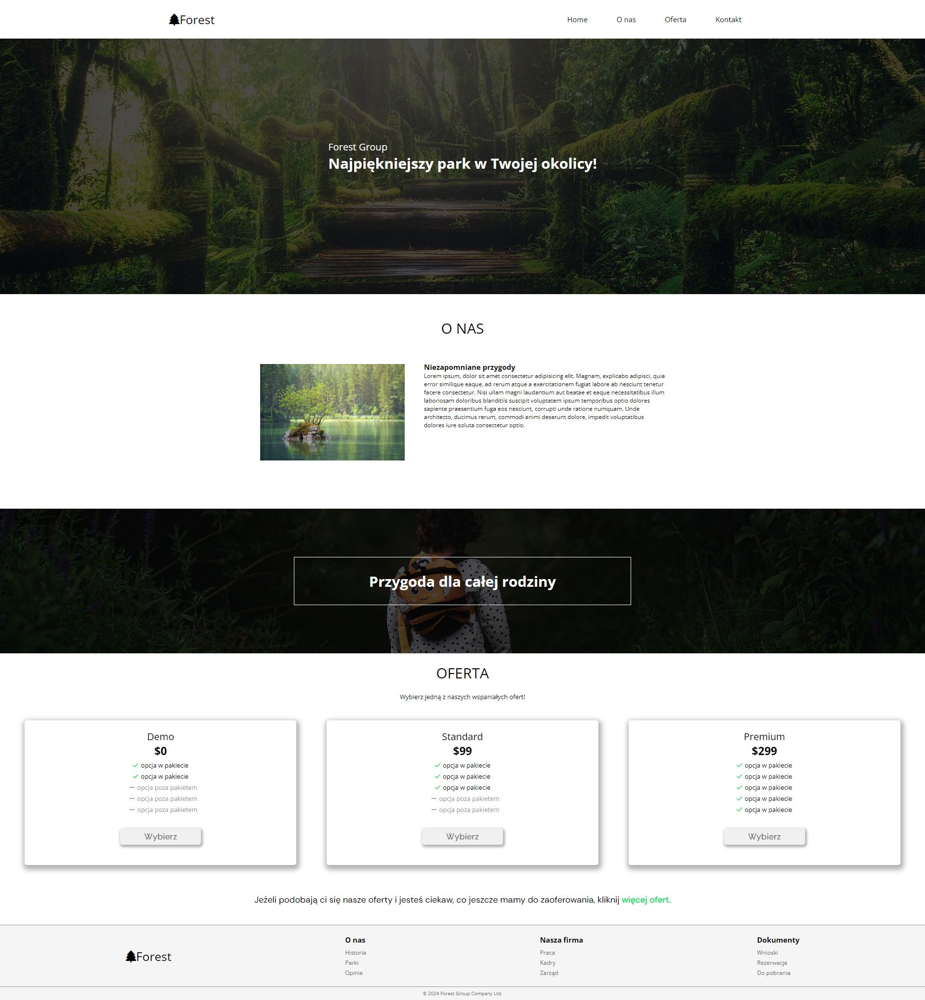
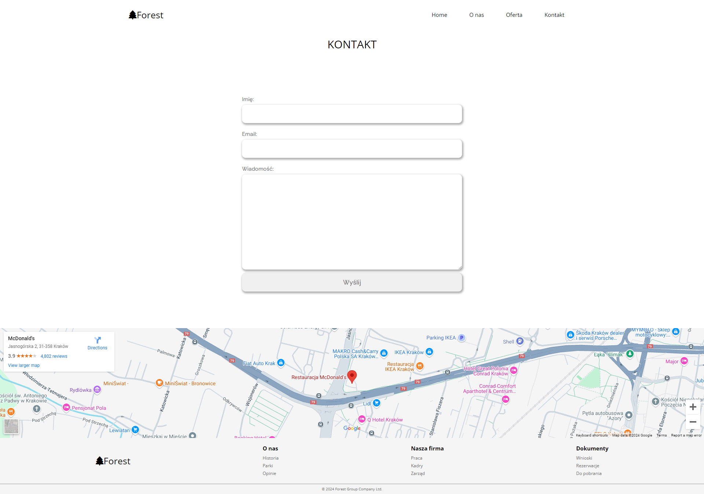

# 🌲 Forest-Page

**Forest-Page** is a beautifully designed website dedicated to showcasing artistic representations of forests and nature. The site features a variety of artworks, including photography, illustrations, and digital art, highlighting the beauty and diversity of forest ecosystems. This project was developed as part of a course by **Mateusz Maj** at **MMC School**.

## 🎨 Project Overview

- **HTML**: Provides the structure of the website and its artistic elements.
- **CSS**: Enhances the visual aesthetics for an appealing and immersive experience.
- **JavaScript**: Adds interactivity, such as image sliders and animations to engage users.

## 🚀 Technologies Used

| HTML | CSS | JavaScript | Gulp | SCSS |
|------|-----|------------|------|------|
|  |  |  |  | 

## 📸 Live Demo

